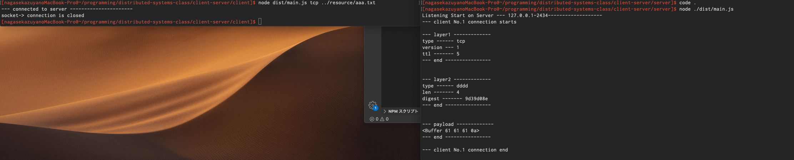

## 実行方法

1. client/serverフォルダに移動

```cd client or server```

2. ライブラリ依存関係の解決

```npm install```

3. TypeScriptをコンパイルして単一ファイルにまとめる

```npm run build```

4. 作成したファイルを実行

サーバー側実行

```node dist/main.js```

クライアント側 実行

``` node dist/main.js tcp ../resource/aaa.txt ```

第一引数 - tcp or udp

第二引数 - main.jsから送信するリソースファイルへの相対パス


でclient/serverが起動します


実行結果

